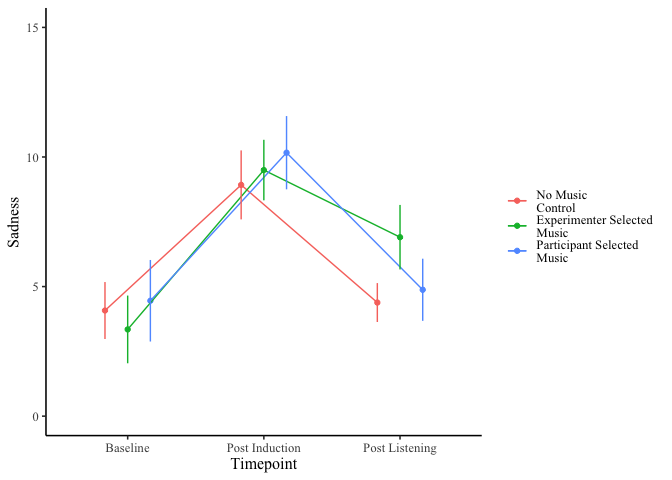

Study 1
================

  - [Create Scores](#create-scores)
  - [Reliabilities](#reliabilities)
  - [ANOVA](#anova)

``` r
s1raw <- read_csv("../data/study1_RMER.csv") %>% 
  select(id,
         Age,
         Gender,
         Condition, 
         MusicInfo4_1,
         contains("RRQ"),
         contains("POMS"),
         contains("MARS")) %>% 
  mutate(Condition = factor(Condition, 
                            levels = c(1, 2, 3),
                            labels = c("Control", "Experimenter Selected", "Self Selected")),
         Gender = as.factor(Gender),
         id = as.factor(id))
```

# Create Scores

``` r
s1dat <- s1raw %>% 
  mutate(Baseline = rowSums(select(., POMSDSF1_1:POMSDSF8_1)),
         PostInduction = rowSums(select(., POMSDSF1_2:POMSDSF8_2)),
         PostListening = rowSums(select(., POMSDSF1_3:POMSDSF8_3)),
         MARS_Pos = rowMeans(select(., MARS1_1,
                                    MARS2_1,
                                    MARS6_1,
                                    MARS7_1, 
                                    MARS8_1,
                                    MARS9_1,
                                    MARS11_1,
                                    MARS12_1,
                                    MARS14_1,
                                    MARS15_1)),
         MARS_Neg = rowMeans(select(., MARS3_1,
                                    MARS4_1,
                                    MARS5_1,
                                    MARS10_1,
                                    MARS13_1)),
         RRQ6_1 = 6 - .$RRQ6_1,
         RRQ9_1 = 6 - .$RRQ9_1,
         RRQ10_1 = 6 - .$RRQ10_1) 

s1dat <- s1dat %>%  mutate(Rumination = rowMeans(select(., RRQ1_1:RRQ12_1)))
s1dat <- s1dat %>% mutate(RumSplit = dicho(.$Rumination, val.labels = c("Low Rumiantion", "High Rumination")))

s1dat %>% 
  select(Baseline, PostInduction, PostListening, Rumination, MARS_Pos, MARS_Neg) %>%
  skimr::skim() %>% 
  skimr::kable()
```

    ## Skim summary statistics  
    ##  n obs: 128    
    ##  n variables: 6    
    ## 
    ## Variable type: numeric
    ## 
    ##    variable       missing    complete     n     mean     sd      p0     p25     p50     p75     p100      hist   
    ## ---------------  ---------  ----------  -----  ------  ------  ------  ------  ------  ------  ------  ----------
    ##    Baseline          0         128       128    3.99    5.1      0       0       2       5       26     ▇▂▁▁▁▁▁▁ 
    ##    MARS_Neg          0         128       128    2.57    0.65    1.2     2.2     2.6      3      4.6     ▃▅▆▇▆▃▁▁ 
    ##    MARS_Pos          0         128       128    4.88    0.73    3.1     4.4     4.9     5.4      7      ▁▃▇▇▇▅▁▁ 
    ##  PostInduction       0         128       128    9.48    6.7      0       4       8       13      27     ▃▇▅▃▂▁▂▁ 
    ##  PostListening       0         128       128    5.4     6.12     0       1       4       8       30     ▇▃▂▁▁▁▁▁ 
    ##   Rumination         0         128       128    3.71    0.62    2.17    3.33    3.83    4.08     5      ▂▁▂▆▇▆▂▂

# Reliabilities

``` r
# Baseline ALpha 
psych::alpha(select(s1dat, POMSDSF1_1:POMSDSF8_1 ))$total$raw_alpha
```

    ## [1] 0.9242407

``` r
# Post Induction Alpha
psych::alpha(select(s1dat, POMSDSF1_2:POMSDSF8_2 ))$total$raw_alpha
```

    ## [1] 0.9288304

``` r
# Post Listening Alpha 
psych::alpha(select(s1dat, POMSDSF1_3:POMSDSF8_3 ))$total$raw_alpha
```

    ## [1] 0.9435892

``` r
# Rumination Alpha 
psych::alpha(select(s1dat, RRQ1_1:RRQ12_1 ))$total$raw_alpha
```

    ## [1] 0.8891114

``` r
# MARS Positive Alpha 
psych::alpha(select(s1dat, MARS1_1,
                    MARS2_1,
                    MARS6_1,
                    MARS7_1, 
                    MARS8_1,
                    MARS9_1,
                    MARS11_1,
                    MARS12_1,
                    MARS14_1,
                    MARS15_1))$total$raw_alpha
```

    ## [1] 0.8405795

``` r
#MARS Negative Alpha 
psych::alpha(select(s1dat, MARS3_1,
                    MARS4_1,
                    MARS5_1,
                    MARS10_1,
                    MARS13_1))$total$raw_alpha
```

    ## [1] 0.4447691

# ANOVA

``` r
jmv::anovaRM(
    data = s1dat,
    rm = list(
        list(
            label="Timepoint",
            levels=c(
                "Baseline",
                "Post Induction",
                "Post Listening"))),
    rmCells = list(
        list(
            measure="Baseline",
            cell="Baseline"),
        list(
            measure="PostInduction",
            cell="Post Induction"),
        list(
            measure="PostListening",
            cell="Post Listening")),
    bs = vars(Condition, RumSplit),
    effectSize = "eta",
    depLabel = "Sadness",
    rmTerms = ~ Timepoint,
    bsTerms = ~ Condition + RumSplit + Condition:RumSplit,
    postHoc = list(
        "Timepoint",
        c("Timepoint", "Condition")),
    emMeans = ~ Timepoint:Condition,
    emmTables = TRUE)
```

    ## NOTE: Results may be misleading due to involvement in interactions
    ## NOTE: Results may be misleading due to involvement in interactions

    ## 
    ##  REPEATED MEASURES ANOVA
    ## 
    ##  Within Subjects Effects                                                                                
    ##  ────────────────────────────────────────────────────────────────────────────────────────────────────── 
    ##                                    Sum of Squares    df     Mean Square    F          p         η²      
    ##  ────────────────────────────────────────────────────────────────────────────────────────────────────── 
    ##    Timepoint                             2068.757      2       1034.379    62.8055    < .001    0.063   
    ##    Timepoint:Condition                    160.093      4         40.023     2.4301     0.048    0.005   
    ##    Timepoint:RumSplit                       0.575      2          0.287     0.0174     0.983    0.000   
    ##    Timepoint:Condition:RumSplit            57.910      4         14.477     0.8790     0.477    0.002   
    ##    Residual                              4018.574    244         16.470                                 
    ##  ────────────────────────────────────────────────────────────────────────────────────────────────────── 
    ##    Note. Type 3 Sums of Squares
    ## 
    ## 
    ##  Between Subjects Effects                                                                  
    ##  ───────────────────────────────────────────────────────────────────────────────────────── 
    ##                          Sum of Squares    df     Mean Square    F        p        η²      
    ##  ───────────────────────────────────────────────────────────────────────────────────────── 
    ##    Condition                       45.8      2           22.9    0.329    0.720    0.001   
    ##    RumSplit                       609.0      1          609.0    8.760    0.004    0.019   
    ##    Condition:RumSplit             270.3      2          135.2    1.944    0.147    0.008   
    ##    Residual                      8481.1    122           69.5                              
    ##  ───────────────────────────────────────────────────────────────────────────────────────── 
    ##    Note. Type 3 Sums of Squares
    ## 
    ## 
    ##  POST HOC TESTS
    ## 
    ##  Post Hoc Comparisons - Timepoint                                                                  
    ##  ───────────────────────────────────────────────────────────────────────────────────────────────── 
    ##    Timepoint              Timepoint         Mean Difference    SE       df     t         p-tukey   
    ##  ───────────────────────────────────────────────────────────────────────────────────────────────── 
    ##    Baseline          -    Post Induction              -5.57    0.516    244    -10.79    < .001   
    ##                      -    Post Listening              -1.43    0.516    244     -2.77      0.017   
    ##    Post Induction    -    Post Listening               4.14    0.516    244      8.02    < .001   
    ##  ───────────────────────────────────────────────────────────────────────────────────────────────── 
    ## 
    ## 
    ##  Post Hoc Comparisons - Timepoint:Condition                                                                                                           
    ##  ──────────────────────────────────────────────────────────────────────────────────────────────────────────────────────────────────────────────────── 
    ##    Timepoint         Condition                     Timepoint         Condition                Mean Difference    SE       df     t          p-tukey   
    ##  ──────────────────────────────────────────────────────────────────────────────────────────────────────────────────────────────────────────────────── 
    ##    Baseline          Control                  -    Baseline          Experimenter Selected             0.7292    1.291    238     0.5650      1.000   
    ##                                               -    Baseline          Self Selected                    -0.3771    1.292    238    -0.2918      1.000   
    ##                                               -    Post Induction    Control                          -4.8472    0.905    244    -5.3540    < .001   
    ##                                               -    Post Induction    Experimenter Selected            -5.4197    1.291    238    -4.1993      0.001   
    ##                                               -    Post Induction    Self Selected                    -6.0899    1.292    238    -4.7119    < .001   
    ##                                               -    Post Listening    Control                          -0.3079    0.905    244    -0.3401      1.000   
    ##                                               -    Post Listening    Experimenter Selected            -2.8297    1.291    238    -2.1925      0.414   
    ##                                               -    Post Listening    Self Selected                    -0.8005    1.292    238    -0.6193      0.999   
    ##                      Experimenter Selected    -    Baseline          Self Selected                    -1.1063    1.279    238    -0.8648      0.995   
    ##                                               -    Post Induction    Control                          -5.5764    1.291    238    -4.3207    < .001   
    ##                                               -    Post Induction    Experimenter Selected            -6.1489    0.887    244    -6.9317    < .001   
    ##                                               -    Post Induction    Self Selected                    -6.8191    1.279    238    -5.3306    < .001   
    ##                                               -    Post Listening    Control                          -1.0370    1.291    238    -0.8035      0.997   
    ##                                               -    Post Listening    Experimenter Selected            -3.5589    0.887    244    -4.0120      0.003   
    ##                                               -    Post Listening    Self Selected                    -1.5296    1.279    238    -1.1957      0.957   
    ##                      Self Selected            -    Post Induction    Control                          -4.4701    1.292    238    -3.4586      0.018   
    ##                                               -    Post Induction    Experimenter Selected            -5.0426    1.279    238    -3.9419      0.003   
    ##                                               -    Post Induction    Self Selected                    -5.7128    0.890    244    -6.4216    < .001   
    ##                                               -    Post Listening    Control                           0.0692    1.292    238     0.0536      1.000   
    ##                                               -    Post Listening    Experimenter Selected            -2.4526    1.279    238    -1.9172      0.603   
    ##                                               -    Post Listening    Self Selected                    -0.4233    0.890    244    -0.4759      1.000   
    ##    Post Induction    Control                  -    Post Induction    Experimenter Selected            -0.5725    1.291    238    -0.4436      1.000   
    ##                                               -    Post Induction    Self Selected                    -1.2427    1.292    238    -0.9615      0.989   
    ##                                               -    Post Listening    Control                           4.5394    0.905    244     5.0139    < .001   
    ##                                               -    Post Listening    Experimenter Selected             2.0175    1.291    238     1.5632      0.824   
    ##                                               -    Post Listening    Self Selected                     4.0468    1.292    238     3.1311      0.050   
    ##                      Experimenter Selected    -    Post Induction    Self Selected                    -0.6702    1.279    238    -0.5239      1.000   
    ##                                               -    Post Listening    Control                           5.1119    1.291    238     3.9608      0.003   
    ##                                               -    Post Listening    Experimenter Selected             2.5900    0.887    244     2.9198      0.089   
    ##                                               -    Post Listening    Self Selected                     4.6193    1.279    238     3.6110      0.011   
    ##                      Self Selected            -    Post Listening    Control                           5.7821    1.292    238     4.4737    < .001   
    ##                                               -    Post Listening    Experimenter Selected             3.2602    1.279    238     2.5486      0.215   
    ##                                               -    Post Listening    Self Selected                     5.2895    0.890    244     5.9457    < .001   
    ##    Post Listening    Control                  -    Post Listening    Experimenter Selected            -2.5219    1.291    238    -1.9540      0.577   
    ##                                               -    Post Listening    Self Selected                    -0.4926    1.292    238    -0.3811      1.000   
    ##                      Experimenter Selected    -    Post Listening    Self Selected                     2.0293    1.279    238     1.5863      0.811   
    ##  ──────────────────────────────────────────────────────────────────────────────────────────────────────────────────────────────────────────────────── 
    ## 
    ## 
    ##  ESTIMATED MARGINAL MEANS
    ## 
    ##  TIMEPOINT:CONDITION
    ## 
    ##  Estimated Marginal Means - Timepoint:Condition                                  
    ##  ─────────────────────────────────────────────────────────────────────────────── 
    ##    Condition                Timepoint         Mean     SE       Lower    Upper   
    ##  ─────────────────────────────────────────────────────────────────────────────── 
    ##    Control                  Baseline           4.08    0.913     2.28     5.87   
    ##                             Post Induction     8.92    0.913     7.12    10.72   
    ##                             Post Listening     4.38    0.913     2.58     6.18   
    ##    Experimenter Selected    Baseline           3.35    0.903     1.57     5.13   
    ##                             Post Induction     9.50    0.903     7.72    11.27   
    ##                             Post Listening     6.91    0.903     5.13     8.68   
    ##    Self Selected            Baseline           4.45    0.904     2.67     6.23   
    ##                             Post Induction    10.17    0.904     8.38    11.95   
    ##                             Post Listening     4.88    0.904     3.09     6.66   
    ##  ───────────────────────────────────────────────────────────────────────────────

<!-- -->
