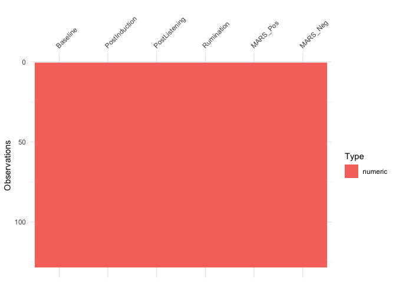

Study 1
================

``` r
s1raw <- read_csv("../data/s1.csv") 

names(s1raw)
```

    ##   [1] "id"                   "MusicAccess"          "MusicAccessNo"       
    ##   [4] "Age"                  "Gender"               "Ethnicity"           
    ##   [7] "Nationality"          "Sample"               "MARS1_1"             
    ##  [10] "MARS2_1"              "MARS3_1"              "MARS4_1"             
    ##  [13] "MARS5_1"              "MARS6_1"              "MARS7_1"             
    ##  [16] "MARS8_1"              "MARS9_1"              "MARS10_1"            
    ##  [19] "MARS11_1"             "MARS12_1"             "MARS13_1"            
    ##  [22] "MARS14_1"             "MARS15_1"             "POMSDSF1_1"          
    ##  [25] "POMSDSF2_1"           "POMSDSF3_1"           "POMSDSF4_1"          
    ##  [28] "POMSDSF5_1"           "POMSDSF6_1"           "POMSDSF7_1"          
    ##  [31] "POMSDSF8_1"           "Sadness_MIP"          "MIP_timing_3"        
    ##  [34] "POMSDSF1_2"           "POMSDSF2_2"           "POMSDSF3_2"          
    ##  [37] "POMSDSF4_2"           "POMSDSF5_2"           "POMSDSF6_2"          
    ##  [40] "POMSDSF7_2"           "POMSDSF8_2"           "Condition"           
    ##  [43] "Cond_Control"         "Control_timing_3"     "Cond_Chet"           
    ##  [46] "Chet_timing_3"        "Cond_SelfSelected"    "Cond_SS_Instructions"
    ##  [49] "Cond_SS_Timer_3"      "SelfSelected_Song1"   "SelfSelected_Song2"  
    ##  [52] "track_name"           "artist_name"          "album_name"          
    ##  [55] "track_popularity"     "danceability"         "energy"              
    ##  [58] "key"                  "loudness"             "mode"                
    ##  [61] "speechiness"          "acousticness"         "instrumentalness"    
    ##  [64] "liveness"             "valence"              "tempo"               
    ##  [67] "duration_ms"          "time_signature"       "key_mode"            
    ##  [70] "POMSDSF1_3"           "POMSDSF2_3"           "POMSDSF3_3"          
    ##  [73] "POMSDSF4_3"           "POMSDSF5_3"           "POMSDSF6_3"          
    ##  [76] "POMSDSF7_3"           "POMSDSF8_3"           "MusicInfo4_1"        
    ##  [79] "RRQ1_1"               "RRQ2_1"               "RRQ3_1"              
    ##  [82] "RRQ4_1"               "RRQ5_1"               "RRQ6_1"              
    ##  [85] "RRQ7_1"               "RRQ8_1"               "RRQ9_1"              
    ##  [88] "RRQ10_1"              "RRQ11_1"              "RRQ12_1"             
    ##  [91] "RRQ13_1"              "RRQ14_1"              "RRQ15_1"             
    ##  [94] "RRQ16_1"              "RRQ17_1"              "RRQ18_1"             
    ##  [97] "RRQ19_1"              "RRQ20_1"              "RRQ21_1"             
    ## [100] "RRQ22_1"              "RRQ23_1"              "RRQ24_1"

# Create Scores

``` r
s1dat <- s1raw %>% 
  mutate(Baseline = rowSums(select(., POMSDSF1_1:POMSDSF8_1)),
         PostInduction = rowSums(select(., POMSDSF1_2:POMSDSF8_2)),
         PostListening = rowSums(select(., POMSDSF1_3:POMSDSF8_3)),
         MARS_Pos = rowMeans(select(., MARS1_1,
                                    MARS2_1,
                                    MARS6_1,
                                    MARS7_1, 
                                    MARS8_1,
                                    MARS9_1,
                                    MARS11_1,
                                    MARS12_1,
                                    MARS14_1,
                                    MARS15_1)),
         MARS_Neg = rowMeans(select(., MARS3_1,
                                    MARS4_1,
                                    MARS5_1,
                                    MARS10_1,
                                    MARS13_1)),
         RRQ6_1 = 6 - .$RRQ6_1,
         RRQ9_1 = 6 - .$RRQ9_1,
         RRQ10_1 = 6 - .$RRQ10_1) 

s1dat <- s1dat %>%  mutate(Rumination = rowMeans(select(., RRQ1_1:RRQ12_1)))
s1dat <- s1dat %>% mutate(RumSplit = dicho(.$Rumination, val.labels = c("Low Rumiantion", "High Rumination")))

s1dat %>% 
  select(Baseline, PostInduction, PostListening, Rumination, MARS_Pos, MARS_Neg) %>%
  skimr::skim() %>% 
  skimr::kable()
```

    ## Skim summary statistics  
    ##  n obs: 128    
    ##  n variables: 6    
    ## 
    ## Variable type: numeric
    ## 
    ##    variable       missing    complete     n     mean     sd      p0     p25     p50     p75     p100      hist   
    ## ---------------  ---------  ----------  -----  ------  ------  ------  ------  ------  ------  ------  ----------
    ##    Baseline          0         128       128    3.99    5.1      0       0       2       5       26     ▇▂▁▁▁▁▁▁ 
    ##    MARS_Neg          0         128       128    2.57    0.65    1.2     2.2     2.6      3      4.6     ▃▅▆▇▆▃▁▁ 
    ##    MARS_Pos          0         128       128    4.88    0.73    3.1     4.4     4.9     5.4      7      ▁▃▇▇▇▅▁▁ 
    ##  PostInduction       0         128       128    9.48    6.7      0       4       8       13      27     ▃▇▅▃▂▁▂▁ 
    ##  PostListening       0         128       128    5.4     6.12     0       1       4       8       30     ▇▃▂▁▁▁▁▁ 
    ##   Rumination         0         128       128    3.71    0.62    2.17    3.33    3.83    4.08     5      ▂▁▂▆▇▆▂▂

``` r
s1dat %>% 
  select(Baseline, PostInduction, PostListening, Rumination, MARS_Pos, MARS_Neg) %>% 
  vis_dat()
```

<!-- -->

# Reliabilities

``` r
# Baseline ALpha 
psych::alpha(select(s1dat, POMSDSF1_1:POMSDSF8_1 ))$total$raw_alpha
```

    ## [1] 0.9242407

``` r
# Post Induction Alpha
psych::alpha(select(s1dat, POMSDSF1_2:POMSDSF8_2 ))$total$raw_alpha
```

    ## [1] 0.9288304

``` r
# Post Listening Alpha 
psych::alpha(select(s1dat, POMSDSF1_3:POMSDSF8_3 ))$total$raw_alpha
```

    ## [1] 0.9435892

``` r
# Rumination Alpha 
psych::alpha(select(s1dat, RRQ1_1:RRQ12_1 ))$total$raw_alpha
```

    ## [1] 0.8891114

``` r
# MARS Positive Alpha 
psych::alpha(select(s1dat, MARS1_1,
                    MARS2_1,
                    MARS6_1,
                    MARS7_1, 
                    MARS8_1,
                    MARS9_1,
                    MARS11_1,
                    MARS12_1,
                    MARS14_1,
                    MARS15_1))$total$raw_alpha
```

    ## [1] 0.8405795

``` r
#MARS Negative Alpha 
psych::alpha(select(s1dat, MARS3_1,
                    MARS4_1,
                    MARS5_1,
                    MARS10_1,
                    MARS13_1))$total$raw_alpha
```

    ## [1] 0.4447691

## Manipulation Check

``` r
t_apa(t.test(s1dat$PostInduction, s1dat$Baseline, paired = TRUE))
```

    ## t(127) = 9.77, p < .001, d = 0.86

## ANOVA

``` r
s1long <- gather (
  s1dat,
  key = Timepoint,
  value = Sadness,
  PostInduction, PostListening
)

ANOVAs1 <- afex::aov_car(
  formula = Sadness ~ Timepoint*Condition*RumSplit + Error(id/Timepoint),
  data = s1long,
  type = 2,
)
```

    ## Converting to factor: Condition

    ## Contrasts set to contr.sum for the following variables: Condition, RumSplit

``` r
summary(ANOVAs1)
```

    ## 
    ## Univariate Type II Repeated-Measures ANOVA Assuming Sphericity
    ## 
    ##                               Sum Sq num Df Error SS den Df  F value
    ## (Intercept)                  14175.9      1   7725.5    122 223.8628
    ## Condition                      190.6      2   7725.5    122   1.5049
    ## RumSplit                       411.7      1   7725.5    122   6.5008
    ## Condition:RumSplit             275.0      2   7725.5    122   2.1717
    ## Timepoint                     1068.5      1   1715.0    122  76.0090
    ## Condition:Timepoint             82.3      2   1715.0    122   2.9278
    ## RumSplit:Timepoint               0.0      1   1715.0    122   0.0000
    ## Condition:RumSplit:Timepoint    24.7      2   1715.0    122   0.8788
    ##                               Pr(>F)    
    ## (Intercept)                  < 2e-16 ***
    ## Condition                    0.22613    
    ## RumSplit                     0.01202 *  
    ## Condition:RumSplit           0.11837    
    ## Timepoint                    1.7e-14 ***
    ## Condition:Timepoint          0.05729 .  
    ## RumSplit:Timepoint           0.99672    
    ## Condition:RumSplit:Timepoint 0.41791    
    ## ---
    ## Signif. codes:  0 '***' 0.001 '**' 0.01 '*' 0.05 '.' 0.1 ' ' 1

``` r
anova_apa(ANOVAs1, 
          sph_corr = "gg",
          es = "ges",
          format = "html")
```

    ## (Intercept):                  <i>F</i>(1, 122) = 223.86, <i>p</i> < .001, <i>&eta;<sup>2</sup><sub>g</sub></i> =  NA
    ## Condition:                    <i>F</i>(2, 122) = 1.50, <i>p</i> = .226, <i>&eta;<sup>2</sup><sub>g</sub></i> = .02
    ## RumSplit:                     <i>F</i>(1, 122) = 6.50, <i>p</i> = .012, <i>&eta;<sup>2</sup><sub>g</sub></i> = .04
    ## Timepoint:                    <i>F</i>(1, 122) = 76.01, <i>p</i> < .001, <i>&eta;<sup>2</sup><sub>g</sub></i> = .10
    ## Condition:RumSplit:           <i>F</i>(2, 122) = 2.17, <i>p</i> = .118, <i>&eta;<sup>2</sup><sub>g</sub></i> = .03
    ## Condition:Timepoint:          <i>F</i>(2, 122) = 2.93, <i>p</i> = .057, <i>&eta;<sup>2</sup><sub>g</sub></i> < .01
    ## RumSplit:Timepoint:           <i>F</i>(1, 122) = 0.00, <i>p</i> = .997, <i>&eta;<sup>2</sup><sub>g</sub></i> < .01
    ## Condition:RumSplit:Timepoint: <i>F</i>(2, 122) = 0.88, <i>p</i> = .418, <i>&eta;<sup>2</sup><sub>g</sub></i> < .01

# ANOVA

``` r
s1long <-  gather(s1dat,
                  key = Timepoint, 
                  value = Sadness,
                  Baseline, PostInduction, PostListening)


ANOVAs1 <- afex::aov_ez(id = "id",
                        data = s1long,
                       dv = "Sadness",
                       between = c("Condition", "RumSplit"),
                       within = "Timepoint",
                       type = 2,
                       print.formula = TRUE)
```

    ## Formula send to aov_car: Sadness ~ Condition * RumSplit + Error(id/(Timepoint))

    ## Converting to factor: Condition

    ## Contrasts set to contr.sum for the following variables: Condition, RumSplit
