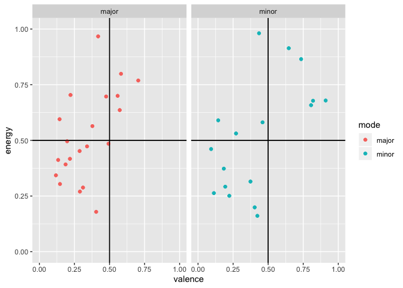

Study 1
================

``` r
<<<<<<< HEAD
s1raw <- read_csv("../data/study1_RMER.csv") %>% 
  dplyr::select(id,
         Age,
         Gender,
         Condition, 
         MusicInfo4_1,
         contains("RRQ"),
         contains("POMS"),
         contains("MARS")) %>% 
  dplyr::mutate(Condition = factor(Condition, 
                            levels = c(1, 2, 3),
                            labels = c("Control", "Experimenter Selected", "Self Selected")),
         Gender = as.factor(Gender),
         id = as.factor(id))
=======
s1raw <- read_csv("../data/s1.csv") 

names(s1raw)
>>>>>>> master
```

    ##   [1] "id"                   "MusicAccess"          "MusicAccessNo"       
    ##   [4] "Age"                  "Gender"               "Ethnicity"           
    ##   [7] "Nationality"          "Sample"               "MARS1_1"             
    ##  [10] "MARS2_1"              "MARS3_1"              "MARS4_1"             
    ##  [13] "MARS5_1"              "MARS6_1"              "MARS7_1"             
    ##  [16] "MARS8_1"              "MARS9_1"              "MARS10_1"            
    ##  [19] "MARS11_1"             "MARS12_1"             "MARS13_1"            
    ##  [22] "MARS14_1"             "MARS15_1"             "POMSDSF1_1"          
    ##  [25] "POMSDSF2_1"           "POMSDSF3_1"           "POMSDSF4_1"          
    ##  [28] "POMSDSF5_1"           "POMSDSF6_1"           "POMSDSF7_1"          
    ##  [31] "POMSDSF8_1"           "Sadness_MIP"          "MIP_timing_3"        
    ##  [34] "POMSDSF1_2"           "POMSDSF2_2"           "POMSDSF3_2"          
    ##  [37] "POMSDSF4_2"           "POMSDSF5_2"           "POMSDSF6_2"          
    ##  [40] "POMSDSF7_2"           "POMSDSF8_2"           "Condition"           
    ##  [43] "Cond_Control"         "Control_timing_3"     "Cond_Chet"           
    ##  [46] "Chet_timing_3"        "Cond_SelfSelected"    "Cond_SS_Instructions"
    ##  [49] "Cond_SS_Timer_3"      "SelfSelected_Song1"   "SelfSelected_Song2"  
    ##  [52] "track_name"           "artist_name"          "album_name"          
    ##  [55] "track_popularity"     "danceability"         "energy"              
    ##  [58] "key"                  "loudness"             "mode"                
    ##  [61] "speechiness"          "acousticness"         "instrumentalness"    
    ##  [64] "liveness"             "valence"              "tempo"               
    ##  [67] "duration_ms"          "time_signature"       "key_mode"            
    ##  [70] "POMSDSF1_3"           "POMSDSF2_3"           "POMSDSF3_3"          
    ##  [73] "POMSDSF4_3"           "POMSDSF5_3"           "POMSDSF6_3"          
    ##  [76] "POMSDSF7_3"           "POMSDSF8_3"           "MusicInfo4_1"        
    ##  [79] "RRQ1_1"               "RRQ2_1"               "RRQ3_1"              
    ##  [82] "RRQ4_1"               "RRQ5_1"               "RRQ6_1"              
    ##  [85] "RRQ7_1"               "RRQ8_1"               "RRQ9_1"              
    ##  [88] "RRQ10_1"              "RRQ11_1"              "RRQ12_1"             
    ##  [91] "RRQ13_1"              "RRQ14_1"              "RRQ15_1"             
    ##  [94] "RRQ16_1"              "RRQ17_1"              "RRQ18_1"             
    ##  [97] "RRQ19_1"              "RRQ20_1"              "RRQ21_1"             
    ## [100] "RRQ22_1"              "RRQ23_1"              "RRQ24_1"

# Create Scores

``` r
s1dat <- s1raw %>% 
  mutate(Baseline = rowSums(dplyr::select(., POMSDSF1_1:POMSDSF8_1)),
         PostInduction = rowSums(dplyr::select(., POMSDSF1_2:POMSDSF8_2)),
         PostListening = rowSums(dplyr::select(., POMSDSF1_3:POMSDSF8_3)),
         MARS_Pos = rowMeans(dplyr::select(., MARS1_1,
                                    MARS2_1,
                                    MARS6_1,
                                    MARS7_1, 
                                    MARS8_1,
                                    MARS9_1,
                                    MARS11_1,
                                    MARS12_1,
                                    MARS14_1,
                                    MARS15_1)),
         MARS_Neg = rowMeans(dplyr::select(., MARS3_1,
                                    MARS4_1,
                                    MARS5_1,
                                    MARS10_1,
                                    MARS13_1)),
         RRQ6_1 = 6 - .$RRQ6_1,
         RRQ9_1 = 6 - .$RRQ9_1,
         RRQ10_1 = 6 - .$RRQ10_1, 
         Condition = as.factor(Condition),
         Condition = fct_recode(Condition, 
                                "Control" = "1", 
                                "Self Selected" = "2",
                                "Experimeter Selected" = "3")
         ) 

s1dat <- s1dat %>%  mutate(Rumination = rowMeans(dplyr::select(., RRQ1_1:RRQ12_1)))
s1dat <- s1dat %>% mutate(RumSplit = dicho(.$Rumination, val.labels = c("Low Rumiantion", "High Rumination")))

s1dat %>% 
  dplyr::select(Baseline, PostInduction, PostListening, Rumination, MARS_Pos, MARS_Neg) %>%
  skimr::skim() %>% 
  skimr::kable()
```

    ## Skim summary statistics  
    ##  n obs: 128    
    ##  n variables: 6    
    ## 
    ## Variable type: numeric
    ## 
    ##    variable       missing    complete     n     mean     sd      p0     p25     p50     p75     p100      hist   
    ## ---------------  ---------  ----------  -----  ------  ------  ------  ------  ------  ------  ------  ----------
    ##    Baseline          0         128       128    3.99    5.1      0       0       2       5       26     ▇▂▁▁▁▁▁▁ 
    ##    MARS_Neg          0         128       128    2.57    0.65    1.2     2.2     2.6      3      4.6     ▃▅▆▇▆▃▁▁ 
    ##    MARS_Pos          0         128       128    4.88    0.73    3.1     4.4     4.9     5.4      7      ▁▃▇▇▇▅▁▁ 
    ##  PostInduction       0         128       128    9.48    6.7      0       4       8       13      27     ▃▇▅▃▂▁▂▁ 
    ##  PostListening       0         128       128    5.4     6.12     0       1       4       8       30     ▇▃▂▁▁▁▁▁ 
    ##   Rumination         0         128       128    3.71    0.62    2.17    3.33    3.83    4.08     5      ▂▁▂▆▇▆▂▂

# Reliabilities

``` r
# Baseline ALpha 
psych::alpha(dplyr::select(s1dat, POMSDSF1_1:POMSDSF8_1 ))$total$raw_alpha
```

    ## [1] 0.9242407

``` r
# Post Induction Alpha
psych::alpha(dplyr::select(s1dat, POMSDSF1_2:POMSDSF8_2 ))$total$raw_alpha
```

    ## [1] 0.9288304

``` r
# Post Listening Alpha 
psych::alpha(dplyr::select(s1dat, POMSDSF1_3:POMSDSF8_3 ))$total$raw_alpha
```

    ## [1] 0.9435892

``` r
# Rumination Alpha 
psych::alpha(dplyr::select(s1dat, RRQ1_1:RRQ12_1 ))$total$raw_alpha
```

    ## [1] 0.8891114

``` r
# MARS Positive Alpha 
psych::alpha(dplyr::select(s1dat, MARS1_1,
                    MARS2_1,
                    MARS6_1,
                    MARS7_1, 
                    MARS8_1,
                    MARS9_1,
                    MARS11_1,
                    MARS12_1,
                    MARS14_1,
                    MARS15_1))$total$raw_alpha
```

    ## [1] 0.8405795

``` r
#MARS Negative Alpha 
psych::alpha(dplyr::select(s1dat, MARS3_1,
                    MARS4_1,
                    MARS5_1,
                    MARS10_1,
                    MARS13_1))$total$raw_alpha
```

    ## [1] 0.4447691

## ANOVA

``` r
s1long <- gather (
  s1dat,
  key = Timepoint,
  value = Sadness,
  Baseline, PostInduction, PostListening
)

ANOVAs1 <- afex::aov_car(
  formula = Sadness ~ Timepoint*Condition*RumSplit + Error(id/Timepoint),
  data = s1long,
  type = 2,
)
```

    ## Contrasts set to contr.sum for the following variables: Condition, RumSplit

``` r
<<<<<<< HEAD
s1long <-  gather(s1dat,
                  key = Timepoint, 
                  value = Sadness,
                  Baseline, PostInduction, PostListening)


ANOVAs1 <- afex::aov_ez(id = "id",
                        data = s1long,
                        dv = "Sadness",
                        between = c("Condition", "RumSplit"),
                        within = "Timepoint",
                        type = 2)
```

    ## Contrasts set to contr.sum for the following variables: Condition, RumSplit

``` r
knitr::kable(anova(ANOVAs1))
```

|                              |   num Df |   den Df |      MSE |          F |       ges |   Pr(\>F) |
| ---------------------------- | -------: | -------: | -------: | ---------: | --------: | --------: |
| Condition                    | 2.000000 | 122.0000 | 69.51726 |  0.8047651 | 0.0088720 | 0.4495524 |
| RumSplit                     | 1.000000 | 122.0000 | 69.51726 |  8.5566376 | 0.0454262 | 0.0041061 |
| Condition:RumSplit           | 2.000000 | 122.0000 | 69.51726 |  1.9444008 | 0.0211698 | 0.1474812 |
| Timepoint                    | 1.894707 | 231.1543 | 17.38482 | 63.2588852 | 0.1428814 | 0.0000000 |
| Condition:Timepoint          | 3.789414 | 231.1543 | 17.38482 |  2.7672314 | 0.0143748 | 0.0307199 |
| RumSplit:Timepoint           | 1.894707 | 231.1543 | 17.38482 |  0.0128512 | 0.0000339 | 0.9844103 |
| Condition:RumSplit:Timepoint | 3.789414 | 231.1543 | 17.38482 |  0.8790408 | 0.0046115 | 0.4725968 |

``` r
afex_plot(ANOVAs1,
          x = "Timepoint",
          trace = "Condition",
          error = "within",
          mapping = "color",
          data_plot = FALSE) +
  scale_x_discrete(labels = c("Baseline", "Post Induction", "Post Listening")) +
  scale_color_discrete(labels = c("No Music \nControl", "Experimenter Selected \nMusic", "Participant Selected \nMusic")) +
  ggplot2::ylim(0, 15) +
  ggplot2::theme_classic(base_size = 12, 
                         base_family = "Times New Roman") +
  ggplot2::theme(legend.title = element_blank()) 
=======
afex::nice(ANOVAs1)
```

    ## Anova Table (Type 2 tests)
    ## 
    ## Response: Sadness
    ##                         Effect           df   MSE         F    ges p.value
    ## 1                    Condition       2, 122 69.52      0.80   .009     .45
    ## 2                     RumSplit       1, 122 69.52   8.56 **    .05    .004
    ## 3           Condition:RumSplit       2, 122 69.52      1.94    .02     .15
    ## 4                    Timepoint 1.89, 231.15 17.38 63.26 ***    .14  <.0001
    ## 5          Condition:Timepoint 3.79, 231.15 17.38    2.77 *    .01     .03
    ## 6           RumSplit:Timepoint 1.89, 231.15 17.38      0.01 <.0001     .98
    ## 7 Condition:RumSplit:Timepoint 3.79, 231.15 17.38      0.88   .005     .47
    ## ---
    ## Signif. codes:  0 '***' 0.001 '**' 0.01 '*' 0.05 '+' 0.1 ' ' 1
    ## 
    ## Sphericity correction method: GG

``` r
afex::afex_plot(ANOVAs1,
                x = "Timepoint",
                trace = "Condition", 
                mapping = "color",
                data_plot = FALSE) +
  ggplot2::theme_classic() + 
  ggplot2::scale_x_discrete(labels = c("Baselie", "Post Induction", "Post Listening")) +
  ggplot2::ylim(0, 15) +
  ggplot2::theme(legend.title = element_blank())
>>>>>>> master
```

    ## NOTE: Results may be misleading due to involvement in interactions

    ## Warning: Panel(s) show a mixed within-between-design.
    ## Error bars do not allow comparisons across all means.
    ## Suppress error bars with: error = "none"

<<<<<<< HEAD
<!-- -->

``` r
summary(emmeans(ANOVAs1, pairwise ~  Timepoint))
=======
<!-- -->

``` r
pairs(emmeans(ANOVAs1, ~ Timepoint|Condition))
>>>>>>> master
```

    ## NOTE: Results may be misleading due to involvement in interactions

<<<<<<< HEAD
    ## $emmeans
    ##  Timepoint     emmean    SE  df lower.CL upper.CL
    ##  Baseline        3.96 0.519 242     2.94     4.98
    ##  PostInduction   9.53 0.519 242     8.50    10.55
    ##  PostListening   5.39 0.519 242     4.37     6.41
    ## 
    ## Results are averaged over the levels of: Condition, RumSplit 
    ## Warning: EMMs are biased unless design is perfectly balanced 
    ## Confidence level used: 0.95 
    ## 
    ## $contrasts
    ##  contrast                      estimate    SE  df t.ratio p.value
    ##  Baseline - PostInduction         -5.57 0.516 244 -10.790 <.0001 
    ##  Baseline - PostListening         -1.43 0.516 244  -2.770 0.0165 
    ##  PostInduction - PostListening     4.14 0.516 244   8.020 <.0001 
    ## 
    ## Results are averaged over the levels of: Condition, RumSplit 
    ## P value adjustment: tukey method for comparing a family of 3 estimates

``` r
s1time <- emmeans(ANOVAs1, pairwise ~ Timepoint | Condition)
```

    ## NOTE: Results may be misleading due to involvement in interactions

``` r
contrast(s1time,
         interaction = "pairwise")$emmeans
```

    ## Condition = Control:
    ##  Timepoint_pairwise            estimate    SE  df t.ratio p.value
    ##  Baseline - PostInduction        -4.847 0.905 244 -5.354  <.0001 
    ##  Baseline - PostListening        -0.308 0.905 244 -0.340  0.7341 
    ##  PostInduction - PostListening    4.539 0.905 244  5.014  <.0001 
    ## 
    ## Condition = Experimenter Selected:
    ##  Timepoint_pairwise            estimate    SE  df t.ratio p.value
    ##  Baseline - PostInduction        -6.149 0.887 244 -6.932  <.0001 
    ##  Baseline - PostListening        -3.559 0.887 244 -4.012  0.0001 
    ##  PostInduction - PostListening    2.590 0.887 244  2.920  0.0038 
    ## 
    ## Condition = Self Selected:
    ##  Timepoint_pairwise            estimate    SE  df t.ratio p.value
    ##  Baseline - PostInduction        -5.713 0.890 244 -6.422  <.0001 
    ##  Baseline - PostListening        -0.423 0.890 244 -0.476  0.6346 
    ##  PostInduction - PostListening    5.289 0.890 244  5.946  <.0001 
    ## 
    ## Results are averaged over the levels of: RumSplit

\`
=======
    ## Condition = Control:
    ##  contrast                      estimate    SE  df t.ratio p.value
    ##  Baseline - PostInduction        -4.847 0.905 244 -5.354  <.0001 
    ##  Baseline - PostListening        -0.308 0.905 244 -0.340  0.9383 
    ##  PostInduction - PostListening    4.539 0.905 244  5.014  <.0001 
    ## 
    ## Condition = Self Selected:
    ##  contrast                      estimate    SE  df t.ratio p.value
    ##  Baseline - PostInduction        -6.149 0.887 244 -6.932  <.0001 
    ##  Baseline - PostListening        -3.559 0.887 244 -4.012  0.0002 
    ##  PostInduction - PostListening    2.590 0.887 244  2.920  0.0107 
    ## 
    ## Condition = Experimeter Selected:
    ##  contrast                      estimate    SE  df t.ratio p.value
    ##  Baseline - PostInduction        -5.713 0.890 244 -6.422  <.0001 
    ##  Baseline - PostListening        -0.423 0.890 244 -0.476  0.8827 
    ##  PostInduction - PostListening    5.289 0.890 244  5.946  <.0001 
    ## 
    ## Results are averaged over the levels of: RumSplit 
    ## P value adjustment: tukey method for comparing a family of 3 estimates

## Rumination Correlation

``` r
s1dat %>% 
  dplyr::select("Rumination", "MARS_Neg", "MARS_Pos") %>% 
  apaTables::apa.cor.table(filename = "s1MARScor.txt",
                 landscape = FALSE)
```

    ## 
    ## 
    ## Means, standard deviations, and correlations with confidence intervals
    ##  
    ## 
    ##   Variable      M    SD   1           2           
    ##   1. Rumination 3.71 0.62                         
    ##                                                   
    ##   2. MARS_Neg   2.57 0.65 -.01                    
    ##                           [-.18, .17]             
    ##                                                   
    ##   3. MARS_Pos   4.88 0.73 .15         -.25**      
    ##                           [-.03, .31] [-.41, -.08]
    ##                                                   
    ## 
    ## Note. M and SD are used to represent mean and standard deviation, respectively.
    ## Values in square brackets indicate the 95% confidence interval.
    ## The confidence interval is a plausible range of population correlations 
    ## that could have caused the sample correlation (Cumming, 2014).
    ## * indicates p < .05. ** indicates p < .01.
    ## 

# Exploratory Analysis of Spotify variables

# Describe

``` r
s1dat %>% 
  dplyr::select(contains("track"),
         contains("ness"),
         energy,
         mode,
         valence,
         duration_ms,
         tempo,
         time_signature,
         artist_name) %>% 
  skimr::skim() %>% 
  skimr::kable(digits = 3)
```

    ## Skim summary statistics  
    ##  n obs: 128    
    ##  n variables: 15    
    ## 
    ## Variable type: character
    ## 
    ##   variable      missing    complete     n     min    max    empty    n_unique 
    ## -------------  ---------  ----------  -----  -----  -----  -------  ----------
    ##  artist_name      90          38       128     4     29       0         38    
    ##     mode          90          38       128     5      5       0         2     
    ##  track_name       90          38       128     3     42       0         38    
    ## 
    ## Variable type: numeric
    ## 
    ##      variable        missing    complete     n       mean          sd         p0        p25        p50       p75       p100       hist   
    ## ------------------  ---------  ----------  -----  -----------  ----------  ---------  --------  ---------  --------  --------  ----------
    ##    acousticness        90          38       128      0.37         0.34      4.9e-05    0.053       0.3       0.66      0.97     ▇▂▃▁▁▂▁▃ 
    ##    duration_ms         90          38       128    248908.13    68660.79     1e+05     2e+05     241772     293350    393120    ▁▃▃▇▆▃▃▂ 
    ##       energy           90          38       128      0.52         0.22       0.16       0.32      0.49       0.68      0.98     ▇▇▇▇▇▇▂▃ 
    ##  instrumentalness      90          38       128      0.057        0.2          0         0       9.8e-06    4e-04      0.89     ▇▁▁▁▁▁▁▁ 
    ##      liveness          90          38       128      0.16         0.11       0.032     0.098      0.12       0.19      0.61     ▆▇▂▂▂▁▁▁ 
    ##      loudness          90          38       128      -8.79        4.78      -22.32     -10.37     -6.88     -5.89     -1.99     ▁▁▁▂▁▃▇▂ 
    ##    Sadness_MIP          0         128       128        1           0           1         1          1         1         1       ▁▁▁▇▁▁▁▁ 
    ##    speechiness         90          38       128      0.067       0.068       0.026     0.031      0.035      0.07      0.32     ▇▁▁▁▁▁▁▁ 
    ##       tempo            90          38       128     119.91        29.9       64.83     98.46     120.03     142.53    180.3     ▃▅▇▅▃▇▃▂ 
    ##   time_signature       90          38       128      3.89         0.31         3         4          4         4         4       ▁▁▁▁▁▁▁▇ 
    ##  track_popularity      90          38       128      50.92       19.17         0         35        53         68        80      ▁▁▃▇▆▇▅▇ 
    ##      valence           90          38       128      0.38         0.22       0.093      0.2       0.36       0.49      0.91     ▇▆▃▆▂▂▂▂

``` r
s1dat %>% 
  tidyr::gather(key = Characteristic,
                value = value,
                valence, energy, acousticness, danceability) %>% 
  ggplot2::ggplot(aes(x = value, y = Characteristic, color = Characteristic, fill = Characteristic)) + 
  ggridges::geom_density_ridges() + 
  ggplot2::xlim(0,1) +
  ggplot2::theme_minimal() 
```

    ## Picking joint bandwidth of 0.1

    ## Warning: Removed 360 rows containing non-finite values
    ## (stat_density_ridges).

<!-- -->

``` r
s1dat %>%
  dplyr::select(valence, energy, acousticness, danceability) %>% 
  apaTables::apa.cor.table()
```

    ## 
    ## 
    ## Means, standard deviations, and correlations with confidence intervals
    ##  
    ## 
    ##   Variable        M    SD   1            2            3           
    ##   1. valence      0.38 0.22                                       
    ##                                                                   
    ##   2. energy       0.52 0.22 .55**                                 
    ##                             [.28, .74]                            
    ##                                                                   
    ##   3. acousticness 0.37 0.34 -.49**       -.83**                   
    ##                             [-.70, -.21] [-.91, -.70]             
    ##                                                                   
    ##   4. danceability 0.53 0.14 .38*         .27          -.39*       
    ##                             [.07, .63]   [-.05, .55]  [-.63, -.08]
    ##                                                                   
    ## 
    ## Note. M and SD are used to represent mean and standard deviation, respectively.
    ## Values in square brackets indicate the 95% confidence interval.
    ## The confidence interval is a plausible range of population correlations 
    ## that could have caused the sample correlation (Cumming, 2014).
    ## * indicates p < .05. ** indicates p < .01.
    ## 

``` r
s1dat %>% 
  filter(mode == "minor" | mode == "major" & !is.na(track_name)) %>% 
  ggplot2::ggplot(aes(x = valence,
                      y = energy,
                      color = mode)) +
  facet_wrap(~ mode, ncol = 2) +
  geom_point() +
  geom_hline(yintercept = .5) +
  geom_vline(xintercept =.5) +
  ylim(0,1) +
  xlim(0,1) +


  ggplot2::geom_point(aes(color = mode)) +
  ggplot2::geom_hline(yintercept = .5) +
  ggplot2::geom_vline(xintercept =.5) + 
  ggplot2::ylim(0,1) + 
  ggplot2::xlim(0,1)
```

    ## Scale for 'y' is already present. Adding another scale for 'y', which
    ## will replace the existing scale.

    ## Scale for 'x' is already present. Adding another scale for 'x', which
    ## will replace the existing scale.

<!-- -->

## Visualise time and
>>>>>>> master
